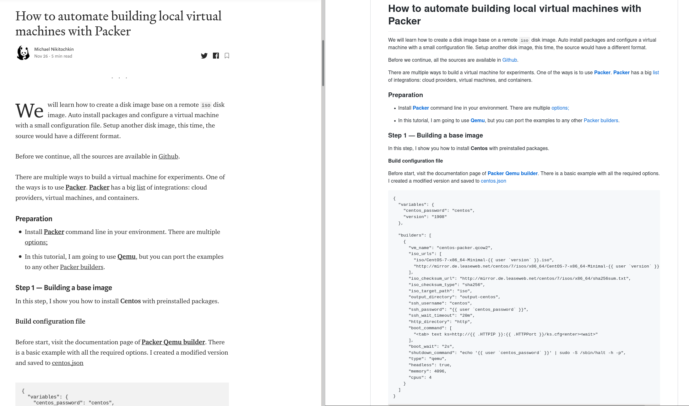

[](https://stand-with-ukraine.pp.ua/)


# Medup

[](https://github.com/miry/medup/releases)
[](https://raw.githubusercontent.com/miry/medup/master/LICENSE)
[](https://stand-with-ukraine.pp.ua)
[](https://stand-with-ukraine.pp.ua)

> Sync all content from Medium with local folder via API

# Table of Contents

* [Usage](#usage)
* [Features](#features)
* [Getting Started](#getting-started)
* [Contributing](#contributing)
* [Contributors](#contributors)
* [License](#license)

# Usage

## Export post

Export a single medium post to local

```shell
medup https://medium.com/notes-and-tips-in-full-stack-development/medup-backups-articles-8bf90179b094
```

## Author's posts

Export all articles written by single author to special folder `posts/miry`

```shell
medup -u miry -d posts/miry
```

Alternative:

```shell
medup @miry -d posts/miry
```

## User's recommendations

Export all articles recommended by `miry`:

```shell
medup -u miry -d posts/recommendations -r
```

Alternative:

```shell
medup @miry -d posts/recommendations -r
```

## Publication's posts

Export all articles written by single author to special folder `posts/miry`

```shell
medup -p jetthoughts -d posts/jetthoughts
```

Alternative:

```shell
medup jetthoughts -d posts/jetthoughts
```

## ENVIRONMENT

* **MEDUP_GITHUB_API_TOKEN**
  Use this GitHub personal access token when accessing the GitHub Gist.

## Mix

```shell
medup -u miry @pftg -p jetthoughts notes-and-tips-in-full-stack-development https://medium.com/notes-and-tips-in-full-stack-development/medup-backups-articles-8bf90179b094
```

It would download all articles for:
1. user `@miry`
1. user `@pftg`
1. publication `jetthoughts`
1. publication `notes-and-tips-in-full-stack-development`
1. single post "Medup backups articles"

# Features

* Discover all articles from user account available in public
* Allow to download all recommended articles by user
* Discover all articles from publisher, that available in public
* Download images used inside article or in `assets` folder
* Save posts in markdown format
* Convert a single article in markdown format
* Extract gists and convert to code blocks

# Getting Started

## Homebrew

Install `medup` tool to the MacOS or Linux via Hombrew:


```shell
$ brew tap miry/medup
$ brew install medup
```

Run export command for **Medium** author *miry* and save articles to local folder:

```shell
$ medup -u miry -d .
$ medup -d . https://medium.com/notes-and-tips-in-full-stack-development/medup-backups-articles-8bf90179b094
```

## Docker

Docker way to make same job:

```shell
$ docker run -v <path to local articles folder>:/posts -it miry/medup -u <user>
```

Download all articles that user has recommended:

```shell
$ docker run -v <path to local articles folder>:/posts -it miry/medup -u <user> --recommended -d posts/recommended
```

## Crystal

Run dumping with source code

```shell
$ shards install
$ crystal run src/cli.cr -- -u <medium user> -d <destination folder>
```

Example download all posts from author https://medium.com/@miry to local folder `posts/miry`

```shell
$ crystal run src/cli.cr -- -u miry -d posts/miry
```

## Build

Build a application binary and execute:

```shell
$ shards install
$ rake build
$ _output/medup -u <medium user> -d <destination folder>
```

# Result

By default all articles destination folder is `posts`.


In the directory, you can find 2 format of files: `.json` and `.md`.
- *JSON* format is the raw, what *Medium* returns.
- *Markdown* format is simple implementation of block formated text.

Images encoded in the result document.
Rich elements content are located in `posts/assets` and integrated with `<IFRAME>`.

## Markdown

Example of exported document (Original Medium post vs Exported Markdown):



# Contributing

1. Fork it ( https://github.com/miry/medup/fork )
2. Create your feature branch (git checkout -b my-new-feature)
3. Commit your changes (git commit -am 'Add some feature')
4. Push to the branch (git push origin my-new-feature)
5. Create a new Pull Request

# Contributors

- [@miry](https://github.com/miry) Michael Nikitochkin - creator, maintainer
- [@alexanderadam](https://github.com/alexanderadam) Alexander - supporter
- [@clawfire](https://github.com/clawfire) Thibault Milan - supporter

# License

This project is under the LGPL-3.0 license.

# Play ownself

### FAQ

* Clean unused assets:
```shell
$ for i in $(ls -1 assets/*); do grep -q "$i" *.md || echo $i; done | xargs rm
```
* Detect potential articles with **IFRAME** content for gists:
```shell
$ for i in $(ls -1 assets/*.html); do grep "gist.github.com" -q $i && grep -n "$i" *.md; done
```
* Detect potential articles' url with **IFRAME** content for gists:
```shell
$ for i in $(ls -1 assets/*.html); do grep "gist.github.com" -q $i && (grep -l "$i" *.md | xargs head | grep url); done
```
* Detect potential articles' url with **IFRAME** content for youtube:
```shell
$ for i in $(ls -1 assets/*.html); do grep "schema=youtube" -q $i && (grep -l "$i" *.md | xargs head | grep url); done
```

### Medium API

1. [Medium API documentation](https://github.com/Medium/medium-api-docs)
1. Generate token on the page https://medium.com/me/settings
1. Create environment variable `MEDIUM_TOKEN=<token>`

1. Verify token with sample query:
```shell
$ curl -H "Authorization: Bearer <token>" https://api.medium.com/v1/me
{"data":{"id":"number","username":"miry","name":"Michael Nikitochkin","url":"https://medium.com/@miry","imageUrl":"https://cdn-images-1.medium.com/fit/c/400/400/0*KgbjgGnH-csHuB8j."}}
```

### Crawler

1. Check public information not covered by API
```shell
$ curl "https://medium.com/@miry?format=json" | cut -c17- && : Remove in the front from response some strange JS code.
```

2. Pagination
```shell
$ curl "https://medium.com/@miry/latest?format=json&limit=100" | cut -c17- && : Remove in the front from response some strange JS code.
```

3. Post info
```shell
curl -s -H "Content-Type: application/json" https://medium.com/@miry/c35b40c499e\?format\=json\&limit\=100
```

4. Stream
```shell
$ curl -s -H "Content-Type: application/json" "https://medium.com/_/api/users/fdf238948af6/profile/stream?source=overview" | cut -c17-
$ curl -s -H "Content-Type: application/json" "https://medium.com/_/api/users/fdf238948af6/profile/stream?limit=100&page=3" | cut -c17- > stream.json
$ cat stream.json| jq ".payload.references.Post[].title"
$ cat stream.json| jq ".payload.paging.next"
```

5. Recommendations
```shell
$ curl -s -H "Content-Type: application/json" https://medium.com/@miry/has-recommended | cut -c17-
$ curl -s -H "Content-Type: application/json" "https://medium.com/_/api/users/fdf238948af6/profile/stream?source=has-recommended" | cut -c17-
```
